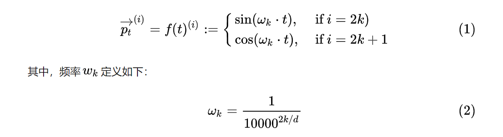

为什么要添加位置编码：
# 如何添加位置编码：
The first idea that might come to mind is to assign a number to each time-step within the [0, 1] range in which 0 means the first word and 1 is the last time-step. Could you figure out what kind of issues it would cause? One of the problems it will introduce is that you can’t figure out how many words are present within a specific range. In other words, time-step delta doesn’t have consistent meaning across different sentences.

我们首先想到的是给[0,1]范围内的每个时间步分配一个数字，其中0表示第一个单词，1表示最后一个时间步。你能想出它会引起什么样的问题吗？它将引入的一个问题是，您无法计算出在一个特定范围内有多少个单词。换句话说，时间步长差在不同的句子中并没有一致的意思。

Another idea is to assign a number to each time-step linearly. That is, the first word is given “1”, the second word is given “2”, and so on. The problem with this approach is that not only the values could get quite large, but also our model can face sentences longer than the ones in training. In addition, our model may not see any sample with one specific length which would hurt generalization of our model.
另一个方法是线性地给每个时间步长分配一个数字。也就是说，第一个单词给“1”，第二个单词给“2”，以此类推。这种方法的问题在于，不仅值可能会变得很大，而且我们的模型可以面对比训练中的句子更长的句子。此外，我们的模型可能不会看到任何具有一个特定长度的样本，这将损害我们的模型的一般化。

Ideally, the following criteria should be satisfied:

理想情况下，应满足以下标准:

It must be deterministic，It should output a unique encoding for each time-step (word’s position in a sentence)
**确定性和唯一性-它应该为每个时间步骤(词在句子中的位置)输出一个唯一的且确定编码**
Distance between any two time-steps should be consistent across sentences with different lengths.
**距离一致性-任何两个时间步长（位置）之间的距离应该在不同长度的句子中保持一致。**
Our model should generalize to longer sentences without any efforts. Its values should be bounded.
**长度扩展性-我们的模型应该不费吹灰之力地推广到更长的句子，它的价值应该是有界的。**

Proposed method
Transformer的作者们提出了一个简单但非常创新的位置编码方法，能够满足上述所有的要求。首先，这种编码不是单一的一个数值，而是包含句子中特定位置信息的d维向量（非常像词向量）。第二，这种编码没有整合进模型，而是用这个向量让每个词具有它在句子中的位置的信息。换句话说，通过注入词的顺序信息来增强模型输入。

给定一个长度为n的输入序列，让t表示词在序列中的位置，$p^t∈R^d$表示t位置对应的向量，d是向量的维度,i表示的是向量元素坐标。f是生成位置向量p^t的函数，定义如下：   
  
从函数定义中可以得出，频率沿向量维度减小。因此，它在波长上形成从2π到10000π几何级数。你也可以认为，位置编码$p^t$是一个包含每个频率的正弦和余弦对（注意d是能被2整除的）。   
 

按照前面比较中的，最后直接将位置编码加到输入上面即可 
$W_t = w_t+ p^t$
为了保证这种相加操作正确，让位置向量的维度等于词向量的维度。
  
  
未完待学习   
https://zhuanlan.zhihu.com/p/106644634
https://kazemnejad.com/blog/transformer_architecture_positional_encoding/

