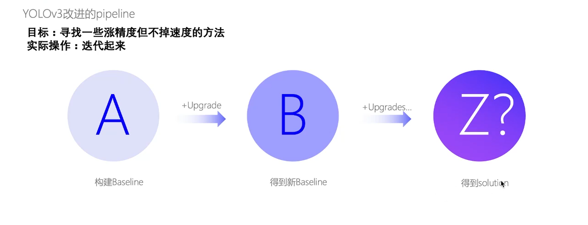

百度工程师提供的方法：
不断迭代
先找一个baseline
然后加上一个trick，如果涨点，那个加上这个trick的作为新的baseline
这样不断的循环，得到最终的模型

这里的trick可以是数据预处理的，可以是结构的，可以是训练技巧等等

tick
数据增强：
两张图直接叠加

图像对应流形中的一个点，平滑之后相当于取两张图像在流形中的一个中间点，能使数据集更为平滑，模型学到的结果也跟平滑了，更精确了

backbone
使用百度内部的优化过的预训练resnet50 backbone
这个比外部共用的好很多

backbone增加DCN，可变形卷积 几乎必涨点但是掉速度 求平衡

neck

+PAN 高分辨率加到低分辨率

+mish

涨性能，几乎不掉速度

loss改进
改进IOU Loss

增加一个预测IOU的分支

针对yolo3 的 改进sigmob难以取到1，但是模型中需要用到1的情况

加soft nms 涨性能 再加Matrix nms 加快速度

训练时候 大batch size 
