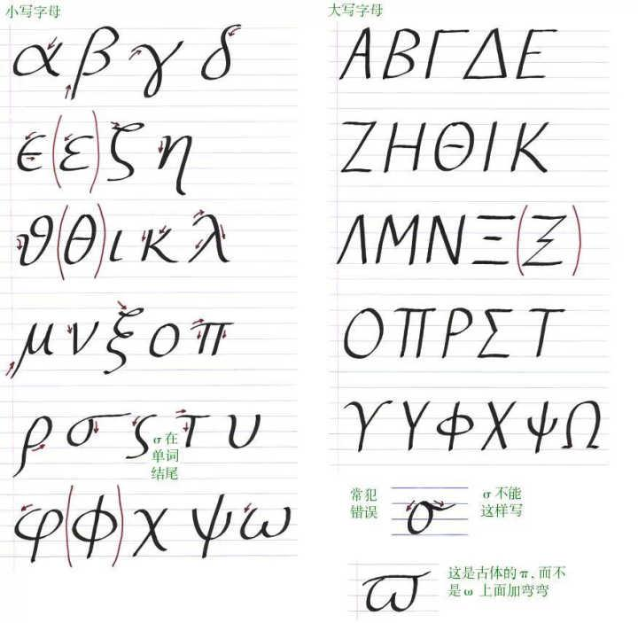

直接在数学上的变换就得出一个定理。比如恒等变化，dx=△x，得出dy=fxdx。爱因斯坦用数学推导(恒等变化？)推出各种物理现象。 

一、常见数学符号读音
1 Α α alpha a:lf 阿尔法 角度；系数
2 Β β beta bet 贝塔 磁通系数；角度；系数
3 Γ γ gamma ga:m 伽马 电导系数（小写）
4 Δ δ delta delt 德尔塔 变动；密度；屈光度
5 Ε ε epsilon ep`silon 伊普西龙 对数之基数 

6 Ζ ζ zeta zat 泽塔 系数；方位角；阻抗；相对粘度；原子序数

7 Η η eta eit 艾塔 磁滞系数；效率（小写）

8 Θ θ thet θit 西塔 温度；相位角

9 Ι ι iot aiot 约塔 微小,一点儿

10 Κ κ kappa kap 卡帕 介质常数

11 ∧ λ lambda lambd 兰布达波长（小写）；体积

12 Μ μ mu mju 缪 磁导系数；微（千分之一）；放大因数（小写）
13 Ν ν nu nju 纽 磁阻系数
14 Ξ ξ xi ksi 克西
15 Ο ο omicron omik`ron 奥密克戎

16 ∏ π pi pai 派 圆周率=圆周÷直径=3.1416

17 Ρ ρ rho rou 肉 电阻系数（小写）

18 ∑ σ sigma `sigma 西格马 总和（大写）,表面密度；跨导（小写）

19 Τ τ tau tau 套 时间常数

20 Υ υ upsilon jup`silon 宇普西龙 位移

21 Φ φ phi fai 佛爱 磁通；角

22 Χ χ chi phai 西

23 Ψ ψ psi psai 普西 角速；介质电通量（静电力线）；角

24 Ω ω omega o`miga 欧米伽 欧姆（大写）；角速（小写）；角

#  正上方 正下方
如果是普通符号，那么直接用\limits命令放在正下方，如
$\sum\limits_{i=1}$  

若是特殊符号，那么要用\mathop先转成数学符号再用\limits，如

$\mathop{\theta}\limits_{i=1}^2$

输入矩阵：
https://zhuanlan.zhihu.com/p/266267223
$$
\left[
\begin{array}{}
1 & 2 \\
3 & 4 \\
\end{array}  
\right]
$$

# 分数
$$
\frac{1}{2}
$$

# 帽子^  
$\hat{i}$